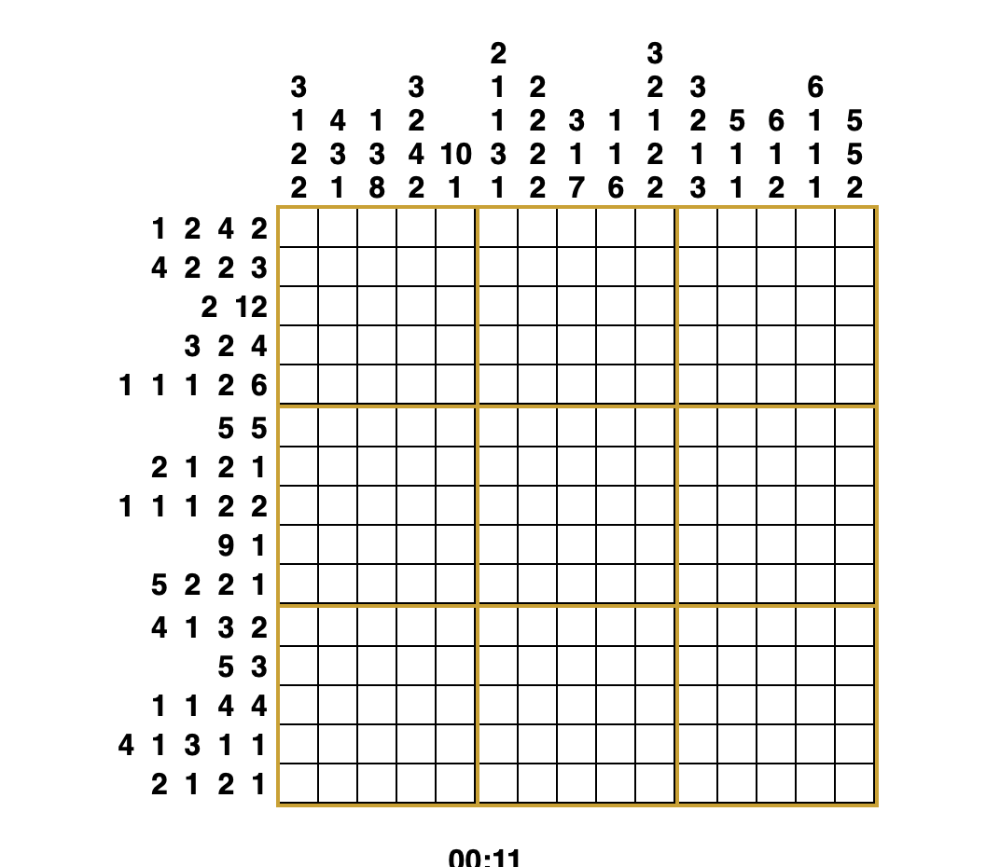
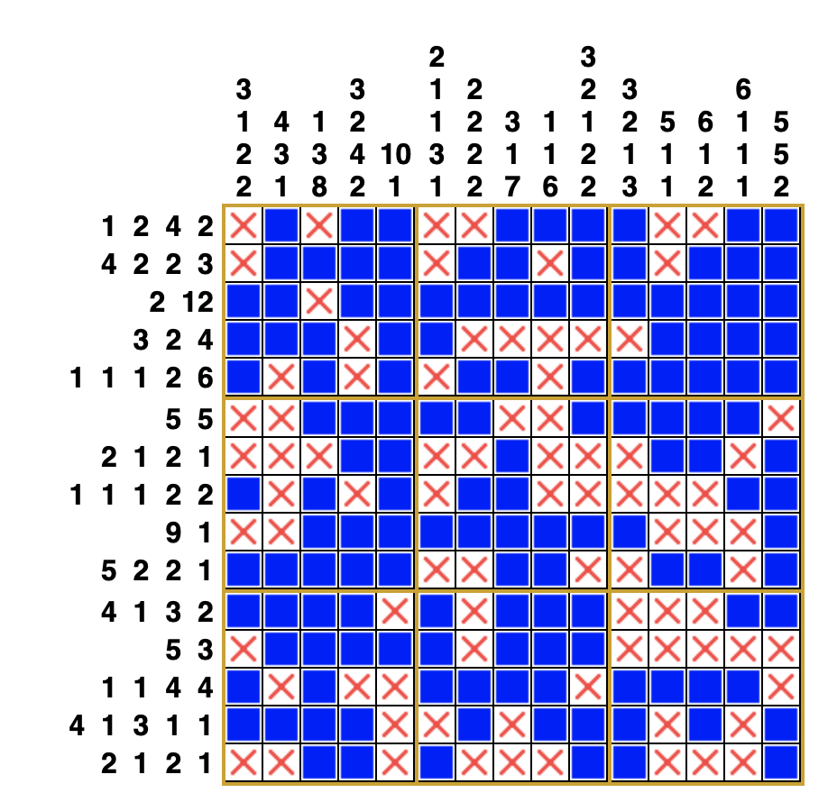

# nonogram-solver

C++ script for solving nonogram puzzles. 

Input: A file with the column count, the row count, the column criteria, and the row criteria.

Output: The ASCII-art solution (with a timer for fun).

For convenience, I've written a Make target:

```
make run IN_FILE=./path/to/file.txt
```

## Input file

Format:

```
col_count
row_count
col_crit_vect
row_crit_vect
```

Example:

```bash
5 # number of columns
7 # number of rows
{{2,1,1},{2, 1},{2,1},{2},{1,3,1}} # column criteria (across the top of the puzzle)
{{2,1},{2},{1},{3},{1,3},{1},{1,1,1}} # row criteria (along the side of the puzzle)
```

## Output

`#` is black.

`.` is white.

`?` is unknown (should not appear in output).

Example:
```
# # . . #
# # . . .
. . . . #
. . # # #
# . # # #
. # . . .
# . # . #
```
## Full example



Input File: 

Saved as `hard.txt`

```
15
15
{{3,1,2,2},{4,3,1},{1,3,8},{3,2,4,2},{10,1},{2,1,1,3,1},{2,2,2,2},{3,1,7},{1,1,6},{3,2,1,2,2},{3,2,1,3},{5,1,1},{6,1,2},{6,1,1,1},{5,5,2}}
{{1,2,4,2},{4,2,2,3},{2,12},{3,2,4},{1,1,1,2,6},{5,5},{2,1,2,1},{1,1,1,2,2},{9,1},{5,2,2,1},{4,1,3,2},{5,3},{1,1,4,4},{4,1,3,1,1},{2,1,2,1}}
```

Output:

```
% make run IN_FILE=./hard.txt
clang-format -i *.cpp *.h
g++ -std=c++11 nonogram.cpp nonogram_run.cpp -g -o nonogram
./nonogram ./hard.txt
. # . # # . . # # # # . . # #
. # # # # . # # . # # . # # #
# # . # # # # # # # # # # # #
# # # . # # . . . . . # # # #
# . # . # . # # . # # # # # #
. . # # # # # . . # # # # # .
. . . # # . . # . . . # # . #
# . # . # . # # . . . . . # #
. . # # # # # # # # # . . . #
# # # # # . . # # . . # # . #
# # # # . # . # # # . . . # #
. # # # # # . # # # . . . . .
# . # . . # # # # . # # # # .
# # # # . . # . # # # . # . #
. . # # . # . . . # # . . . #
Elapsed Time = 0.556[s]
```



##QED